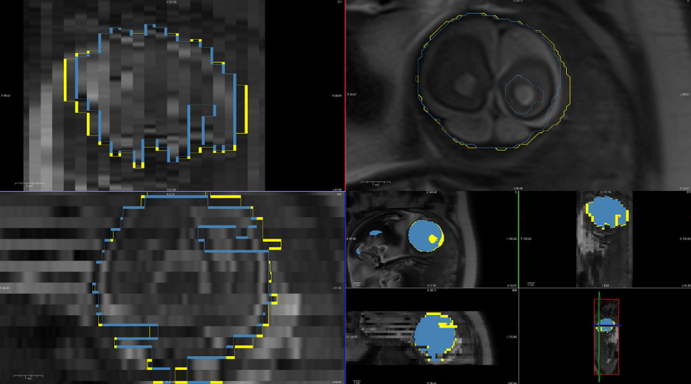
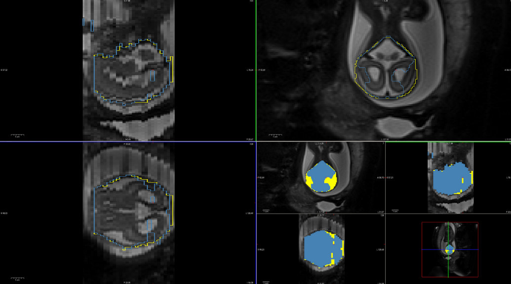

# Automatic Brain Masking

## Table of contents

* [Description](#description)
* [Requirements](#requirements)
* [Limitations](#limitations)
* [Usage](#usage)
* [Setup](#setup)

## Description

Deep learning based project made to automatically mask fetal brains. It can take either individual NIfTI files or the contents
of a specified directory.

Currently only a U-net based model is available.

Depending on the input provided (a file or a directory), this tool will recusively look for all .nii files. 
It will save a new mask with the name name_mask.nii for each .nii file found on the path provided. and it 
will skip those files that end with mask.nii unless specified otherwise with the --remasking flag.

### About this model

This model was trained with a dataset comprising of ~700 reviewed stacks of images and masks, adding to a total of ~20,000 images. 
It has a wider range of data to improve its robustness. For the sake of identifying this model against priors, its called `emerald`.

Here are some images showcasing its performance against the previous model, where the $\textcolor{NavyBlue}{\text{blue}}$ mask corresponds to the $\textcolor{NavyBlue}{\text{old}}$ model and the $\textcolor{yellow}{\text{yellow}}$ mask to $\textcolor{yellow}{\text{emeralds}}$.








## Requirements

- Python 3
- pip

The following can be installed with the requirements.txt file:

- opencv-python-headless == 4.7.0.68
- MedPy == 0.4.0
- scikit-image == 0.19.3
- keras == 2.11.0
- tensorflow == 2.11.0
- tqdm == 4.64.1
- numpy == 1.24.1

## Usage

Its recommended that you create a virtual environment to prevent mixing dependencies. If you don't know how to create one,
check out the [setup](#setup) section.

Once you have a virtual environment with all the requirements installed, you can run this tool with the command:

```python
python individual_brain_mask.py  target_file [target_file ...] [-h] [--remasking] [--no-remasking] [--post-processing] \
[--no-post-processing] [--match MATCH [MATCH ...]] [--dilation_footprint SHAPE SIZE] [--no-dilation]
```
                        
Where:
   
|              Argument             | Description                                                                                                                                              |
|:---------------------------------:|----------------------------------------------------------------------------------------------------------------------------------------------------------|
|           `target_file`           | Input path. Required.                                                                                                                                    |
|                `-h`               | Show help message and exit                                                                                                                               |
|           `--remasking`           | Indicates that images already masked should be remasked, rewritting all **_mask.nii* files found. Defaults to  *false*.                                 |
|          `--no-remasking`         | Indicates to skip images that end with **_mask.nii*                                                                                                      |
|        `--post-processing`        | Indicates that the predicted mask should be post processed (morphological closing and dilation). Defaults to  *true*.                                    |
|       `--no-post-processing`      | Indicates that the predicted mask should *not* be post processed                                                                                         |
|             `--match`             | Specify if only files with certain words should be masked. Not case sensitive.                                                                           |
| `--dilation_footprint SHAPE SIZE` | Specify the shape and size of the footprint used for dilation. Shapes available are  **disk** and **square**. If none specified, default is **disk 2**. |
|         `--no-dilation`           | Masks without dilation.                                                                                                                                  |

## Limitations
- Unet can currently only work with 256x256 images

## Setup

You can create a new virtual environment using the `venv` command:

```python
python -m venv /path/env_name
```
    
This will create a virtual environment called `env_name` in the directory `/path`.
To activate it, run:

```python
source /path/env_name/bin/activate
```

The environments name should appear at the beginnig of the shell surrounded by parentheses, like this:

```python
(env_name)$
```
    
For further information on how virtual envirionments work, check the [python documentation](https://docs.python.org/3/library/venv.html).
    
### Download the tool

Download the source code, cd into your desired location

```python
(env_name)$ git clone https://github.com/sofia-urosa/brain-masking.git
(env_name)$ cd brain-masking
```

Install requirements from requirements.txt

```python
(env_name)$ pip install -r requirements.txt
```
    
 And run the tool using the command found in [usage](#usage).
